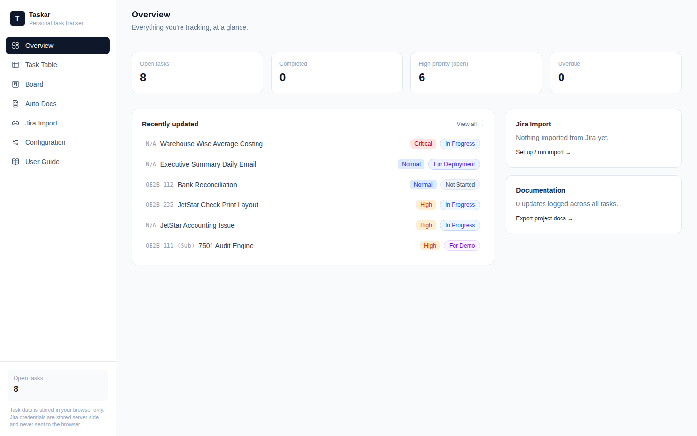
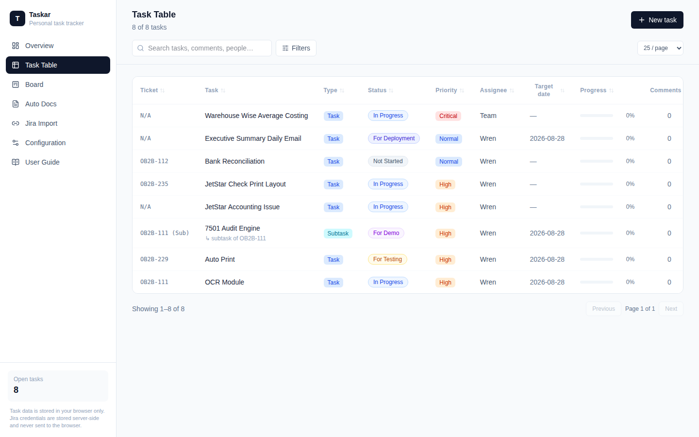
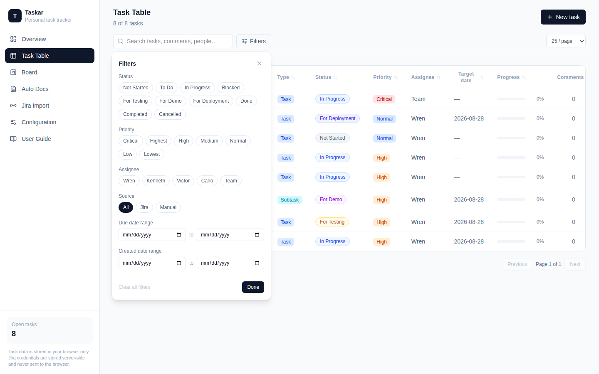
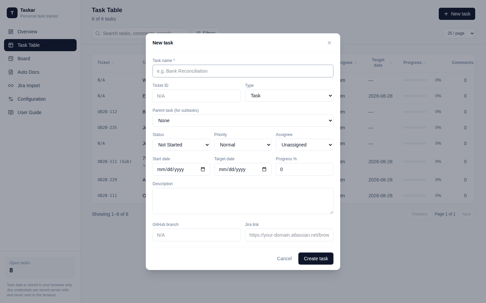
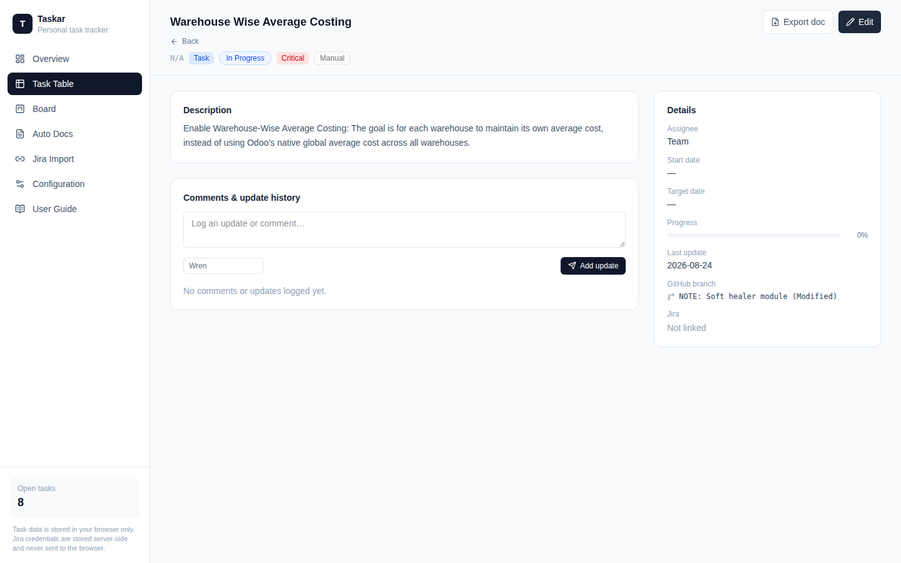
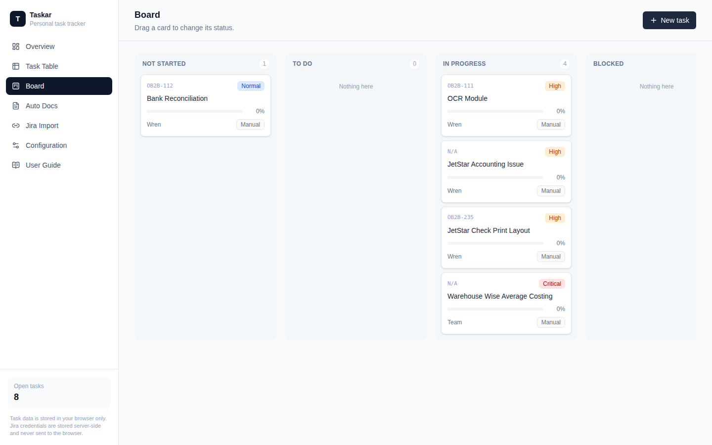
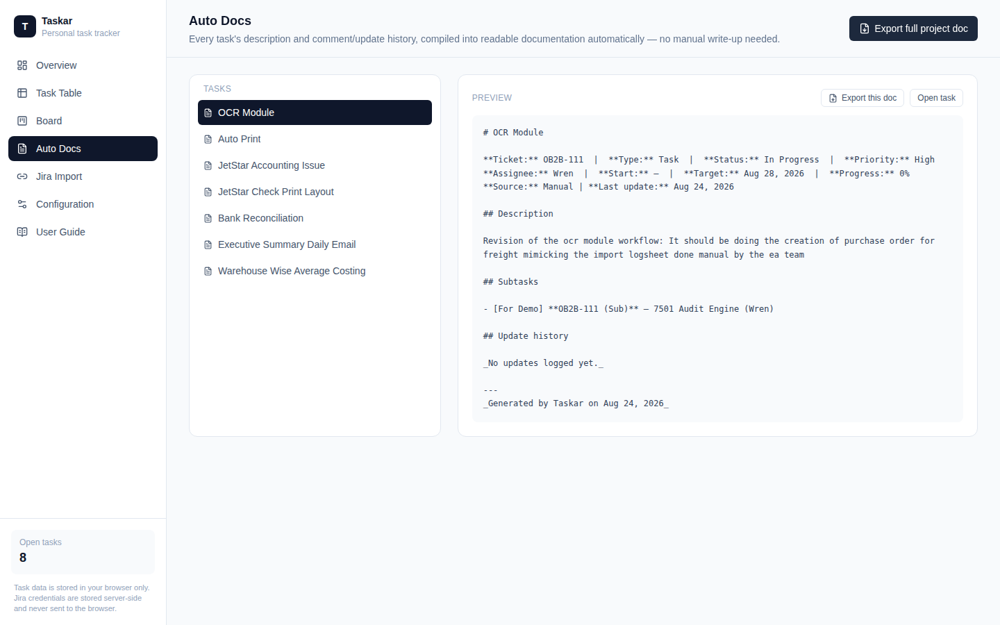
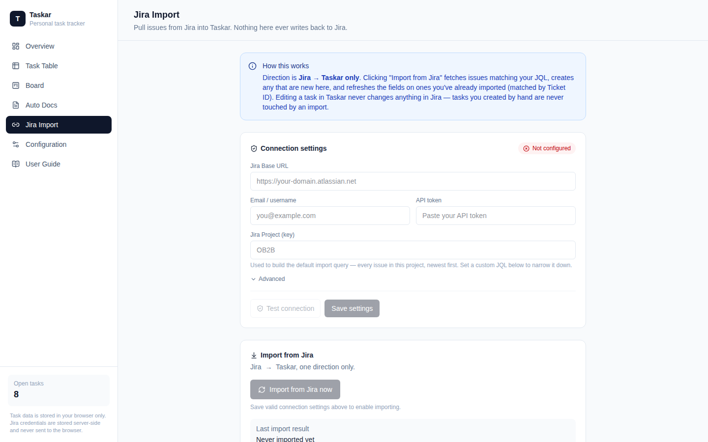
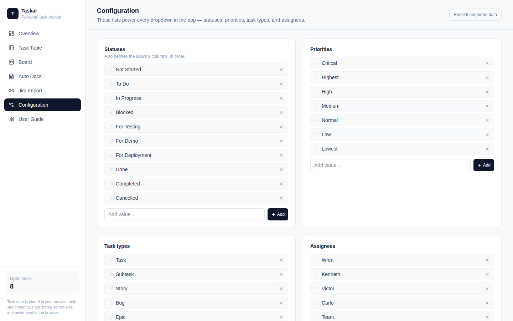
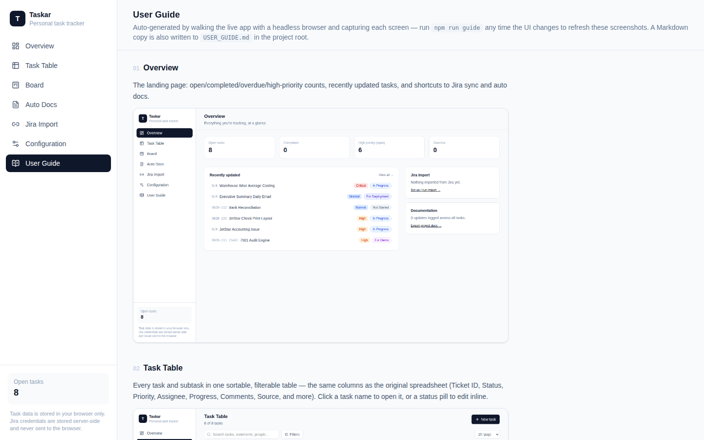

# Taskar User Guide

_Auto-generated by `npm run guide` — re-run it any time the UI changes._

## Overview

The landing page: open/completed/overdue/high-priority counts, recently updated tasks, and shortcuts to Jira Import and Auto Docs.

## Task Table

Every task in one place — the same columns as the original spreadsheet (Ticket ID, Status, Priority, Assignee, Progress, Comments, Source, and more). Click any column to sort, use the search box to find tasks by title, description, assignee, or even comment text, and "New task" is always one click away in the header.

## Power search & filters

The Filters panel combines Status, Priority, Assignee, Source (Jira vs. manual), and due/created date ranges — all combinable, with a one-click "Clear all filters." Filtering, sorting, search, and pagination all work together.

## Adding a task

"New task" opens a form covering every field from the tracker, including linking a task as a subtask of another.

## Task detail

Full task view: description, subtasks, and a comment/update history thread — plus a one-click "Export doc" button that compiles the whole thing into Markdown.

## Board view

A Kanban board grouped by status. Drag any card to a new column to change its status instantly.

## Auto Docs

The auto documenter: every task's description and update history compiled into clean Markdown automatically, previewable per task or exportable as one full project document.

## Jira Import

Jira connection settings (Base URL, email, API token, project) are configured right here in the UI — no .env editing required. The token is encrypted and stored server-side, never sent to the browser. "Test connection" verifies credentials before you rely on them, and the banner up top spells out exactly what an import does: a one-way pull from Jira into Taskar.

## Configuration

Manage the Statuses, Priorities, Types, and Assignees lists that power every dropdown and the Board's columns.

## This guide, generating itself

The User Guide page you're looking at is built from this same manifest — regenerated automatically whenever the screenshots above are refreshed.

